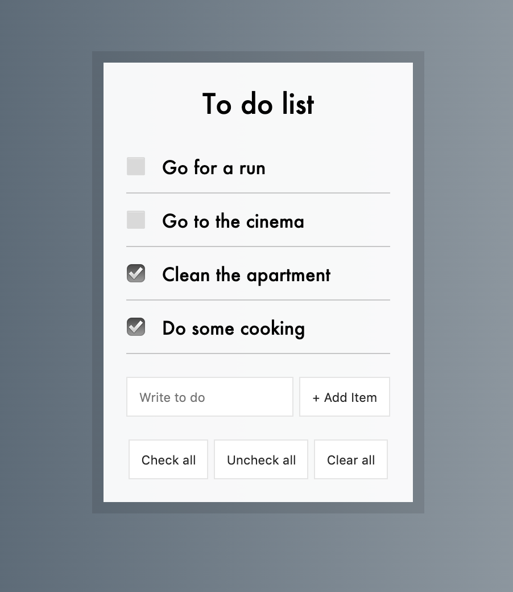

## Getshitdone

# A to do list. Inspired by Wes Bos Javascript 30, Local Storage and Event Delegation

 Try it yourself

------> <a href="https://getshitdonetodo.netlify.com/">Get shit done</a> <------

